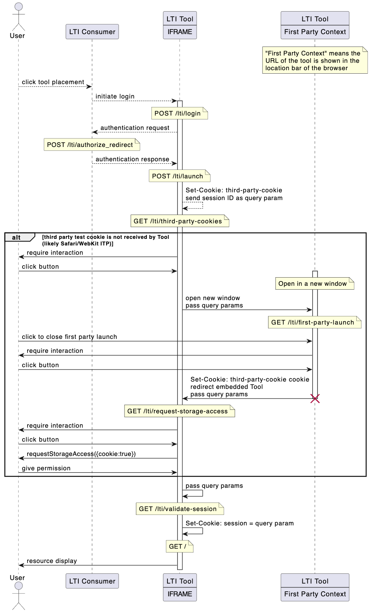

# groton-school/slim-lti-partitioned-session

Negotiate CHIPS partitioned third party session cookies from an embedded LTI Tool

[](https://packagist.org/packages/groton-school/slim-lti-partitioned-session)

# Install

```shell
composer require groton-school/slim-lti-partitioned-session
```

# Use

This implementation expects a default [slim-skeleton](https://github.com/slimphp/Slim-Skeleton#readme) and relies on [groton-school/slim-lti-shim](https://github.com/groton-school/slim-lti-shim#readme) and [packbackbooks/lti-1p3-tool](https://github.com/packbackbooks/lti-1-3-php-library#readme) for core LTI Tool functionality.

1. Optionally, implement [`SettingsInterface`](https://github.com/groton-school/slim-lti-partitioned-session/blob/main/src/SettingsInterface.php) -- alternatively[`DefaultSettings`](https://github.com/groton-school/slim-lti-partitioned-session/blob/main/src/DefaultSettings.php) are available

2. [Define the dependency on either your `SettingsInterface` implementaton or the `DefaultSettings` implementation](https://github.com/groton-school/slim-skeleton/blob/0b32f964d753376ed2c2d9af4460e96342bbe919/app/dependencies.php#L26-L27)

3. [Inject remaining dependencies](https://github.com/groton-school/slim-skeleton/blob/0b32f964d753376ed2c2d9af4460e96342bbe919/app/dependencies.php#L22)

4. [Register the cookie-negotiation routes](https://github.com/groton-school/slim-skeleton/blob/0b32f964d753376ed2c2d9af4460e96342bbe919/app/routes.php#L21-L23)

### groton-school/slim-skeleton@dev-lti/gae

[groton-school/slim-skeleton](https://github.com/groton-school/slim-skeleton/tree/lti/gae) is the canonical example of how this shim is meant to be used.

# How

Given the insidiuous prevalance of user-tracking web technologies, and the use of third-party cookies to facilitate them, many browsers have imposed hard limits on the use of third-party cookies. This is awkward, because the LTI standard is built on the assumption that a) third-party cookies will be readily available for the OIDC handshake and launch and b) most resources will be embedded in a third-party IFRAME context.

This package provides a modified `LaunchHandler` compatible with [groton-school/slim-lti-shim](https://github.com/groton-school/slim-lti-shim) that injects a third-party cookie test into the LTI Tool launch. This is paired with the `PartitionedSession` middleware that ensures that a) all session cookies are sent as both `Secure` and `Partitioned` (which is enough for Chromium-based browsers).

If third-party cookies cannot be initially set (as is the case when working with Safari and other WebKit-based browsers using [ITP](https://www.cookiestatus.com/safari/)), a more interactive permissions-handshake with the user is required. The package negotiates this handshake and then uses the `PartitionedSession` middleware to resume the originally-launched LTI Tool session and provide the LTI resource.


