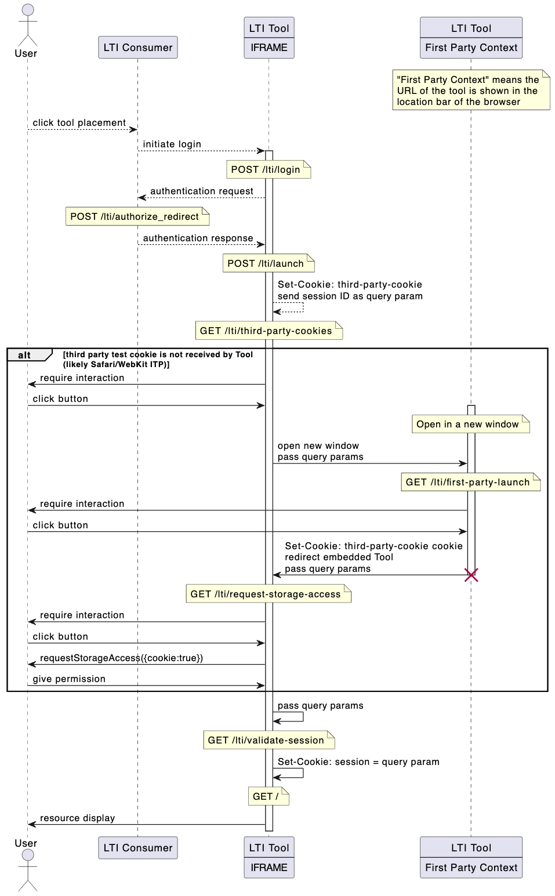

# groton-school/slim-lti-partitioned-session

Negotiate CHIPS partitioned third party session cookies from an embedded LTI Tool

[](https://packagist.org/packages/groton-school/slim-lti-partitioned-session)

# Install

```shell
composer require groton-school/slim-lti-partitioned-session
```

# Use

At the moment, [this is a fairly rigidly-defined package.](https://github.com/groton-school/slim-lti-partitioned-session/issues/1). In order for it to do its thing:

1. [`PhpSession` must be defined as a dependency.](https://github.com/groton-school/slim-skeleton/blob/17a10b398aff956544d8d281a12e07e330198274/app/dependencies.php#L77-L81)
2. [The cookie-negotiation Actions must be assigned to specific routes.](https://github.com/groton-school/slim-skeleton/blob/17a10b398aff956544d8d281a12e07e330198274/app/routes.php#L31-L34)
3. [`SessionStartMiddleware` and `PartitionedSessionMiddleware` must be added as middleware (in order) to routes that need access to the PHP session (including the cookie-negotiation routes and LTI OIDC launch routes)](https://github.com/groton-school/slim-skeleton/blob/17a10b398aff956544d8d281a12e07e330198274/app/routes.php#L36-L37)

See [groton-school/slim-skeleton](https://github.com/groton-school/slim-skeleton) for sample usage.

# How

Given the insidiuous prevalance of user-tracking web technologies, and the use of third-party cookies to facilitate them, many browsers have imposed hard limits on the use of third-party cookies. This is awkward, because the LTI standard is built on the assumption that a) third-party cookies will be readily available for the OIDC handshake and launch and b) most resources will be embedded in a third-party IFRAME context.

This package provides a modified `LaunchHandler` compatible with [groton-school/slim-lti-shim](https://github.com/groton-school/slim-lti-shim) that injects a third-party cookie test into the LTI Tool launch. This is paired with the `PartitionedSession` middleware that ensures that a) all session cookies are sent as both `Secure` and `Partitioned` (which is enough for Chromium-based browsers).

If third-party cookies cannot be initially set (as is the case when working with Safari and other WebKit-based browsers using [ITP](https://www.cookiestatus.com/safari/)), a more interactive permissions-handshake with the user is required. The package negotiates this handshake and then uses the `PartitionedSession` middleware to resume the originally-launched LTI Tool session and provide the LTI resource.


